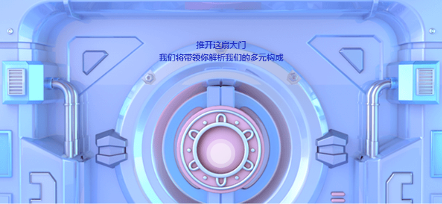

### 整体结构

为了方便只展示 src 目录下的文件

```
│  app.tsx
│  global.less
├─assets
│  ├─font
│  │      font.*  // 字体文件
│  ├─img
│  │      *.png // 配图
│  └─mp3
│          *.mp3 // 音乐
├─components // 组件
│      dapartmentDetail.less // 部门详情面板
│      dapartmentDetail.tsx
│      departmentButton.less // 部门按钮
│      departmentButton.tsx
│      departmentLayer.less // 部门详情页面的基础
│      departmentLayer.tsx
│      departmentSlider.less  // 部门评分滑动条
│      departmentSlider.tsx
│      departmentTitle.less // 部门标题
│      departmentTitle.tsx
│      homeLayer.less // 首页基础
│      homeLayer.tsx
│      Vback.less // 公共返回按钮
│      Vback.tsx
├─interface // TS 接口
│      department.ts // 部门详情 DTO
│      router.ts // umi 的 pages 页面需要访问的路由
│
├─json
│      department.ts // 数据
├─layouts // umi 路由的模板
│      index.less
│      index.tsx
├─pages // 页面
│  │  department.less // 部门介绍详情
│  │  department.tsx
│  │  document.ejs // umi 使用这个来渲染 index.html
│  │  gate.less // 门页面
│  │  gate.tsx
│  │  home.less // 首页 （部门卡片）
│  │  home.tsx
│  │  index.less // 进入页面
│  │  index.tsx
│  │  joinin.less // 二维码页面
│  │  joinin.tsx
└─utilites
        useProcess.ts // 使用 requestAnimationFrame 做的定时器
        useRouter.ts // 使用 react hooks 方式获取 router 而不用高阶组件
        useWord.ts // 模拟打字机
```

## 技术栈

- umi     // 可插拔的企业级 react 应用框架
- swiper  // 移动端网页触摸内容滑动js插件
- react-transition-group // 动画


## 项目运行

使用 [umi](https://umijs.org/) 创建，按照标准即可完成

## 注意点

1. ios 使用 zoom 或者 transforms scale 在微信浏览器上会导致最终效果时不居中的问题

   使用 background-size 来解决，但是会有抖动的问题。

2. ios 微信浏览器上使用 `router.push` 会导致下方出现导航栏

   使用 `router.replace` 解决，但是不会记录上一页

3. 全屏事件需要在用户点击事件的回调函数中触发

4. `window.onresize ` 事件必须写在 setTimeout 的回调函数中不是的话会被提前触发

5. `swiper` 需要使用插件去注册监听事件，使用 react 管理的会出现一两张点击不上的问题

   ```js
    on: {
         tap() {
           // @ts-ignore
           handelDepartmentClick(this.activeIndex % 5)
         },
       },
   ```

   

## 需要改进的

因在该项目比较赶时间，导致有些地方处理的不好，函数命名不规范，目前还未修改

下面主要是一些技术栈选取的问题

#### umi 

1. 已经设定好的 Alias。 但是如果项目比较小，目录结构设计合理其实并没有必要
2. 使用文件目录约定的路由和内置的路由，对 ts 支持不好和比较强的约束
3. 最终生成的 js 文件比较大，修改其生成的文件名比较麻烦
4. 单独的配置文件和其学习成本，以及自定义程度
5. 不能使用最新版的 react

#### react-transition-group

虽然能够使用让 postcss 将其中的 px 自动计算成 vw 但是编写起来比较蛮烦，没有 css in js 的 react spring 方便

## 特别的一些地方

- 首页的轮播图

  使用 Swiper 的 coverflow 切换效果
  
  ```js
  coverflowEffect: {
        rotate: 20,
        stretch: -40,
        depth: -50,
        modifier: 0.6,
        slideShadows: false,
  },
  ```


- 组件间传递信息

  因为比较简单没有引入 redux 直接使用原生的自定义事件，并将数据存储在 localstorage
  
- 首页 （部门卡片）页面的头部会挡住卡片，将下面的头的部分抽出来，使用 vh 来对齐


  ## 更新日志

  本项目遵从 [Angular Style Commit Message Conventions](https://gist.github.com/stephenparish/9941e89d80e2bc58a153)，更新日志由 `standard-changelog` 自动生成。完整日志请点击 [CHANGELOG.md](./CHANGELOG.md)

## 图例





